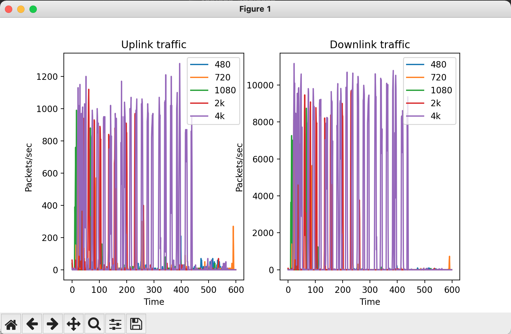
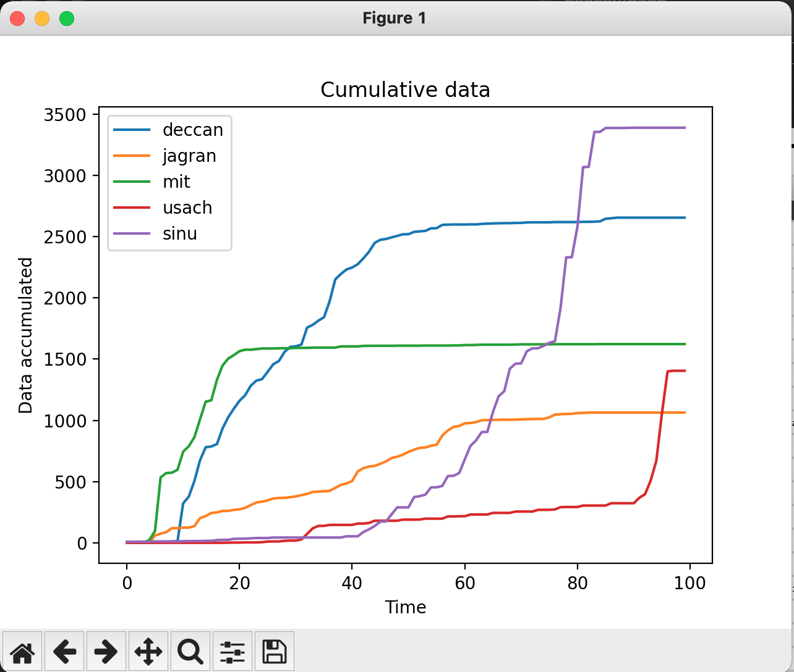

## Activity 1

### Part A

We have used a `.py` file instead of a `.ipynb` file as sugggested in the assignment because the usage of `pyshark` functions is different in a notebook environment which involves using `async` functions (as per our research). For simplicity purposes, we have used the synchronous implementation of the `.pcap` parser.

#### Setup

1. Create a `.env` file with the local IP address of your PC when you took the `pcap` trace
2. The variable should be called `LOCAL_IP_ADDRESS_A`
3. Example: `LOCAL_IP_ADDRESS="10.42.169.54"`
4. This is required for figuring out if the packet is `uplink/downlink`
5. Upload the `.pcap` files in the same directory

**Question1 :** The graphs that were obtained for the `uplink` and `downlink` traffic are shown below

**Question 2:** The burst fraction for different resolutions are mentioned below:

1. 480p: 0.02
2. 720p: 0.10
3. 1080p: 0.15
4. 2k: 0.43
5. 4k: 0.61

### Part B

#### Setup

1. In the same `.env` file, create a variable called `LOCAL_IP_ADDRESS_B`
2. This is to take care of dynamic IPs
3. For example, `LOCAL_IP_ADDRESS_B="10.42.170.206"`

**Question 1:** The time taken to complete each DNS query is listed below

- Deccan - 1.2ms
- Jagran - 1.1ms
- MIT - 13.9ms
- Usach - 54.3ms
- Sinu - 11.3ms

**Insights:** The time taken to resolve the DNS completely is dependent on the distance between our PC and the destination server. Since `MIT` and `Usach` probably have their `VPS` in _USA_ and _Chile_ respectively, it took `1 order` of magnitude higher (in time). This is one factor in the entire process. Since these websites were visited for the first time, their `DNS` lookup was not cached. In that case it would have taken lesser time than the other websites.

**Question 2:** TBD

**Question 3:** The cumulative plots are shown below

## Activity 2

**Question 1, 2:** `TTFB`, `page_load_time` and number of `GET` requests

| Website | TTFB (ms) | Page Load Time (ms) | Total GET Requests |
| ------- | --------- | ------------------- | ------------------ |
| deccan  | 228.380   | 2490.194            | 30                 |
| jagran  | 225.280   | 835.276             | 51                 |
| usach   | 1747.536  | 31872.584           | 141                |
| sinu    | 1836.706  | 23445.594           | 58                 |
| mit     | 172.882   | 616.618             | 24                 |

**Question 3:** Different `MIME` types

| MIME Type                 | Deccan | Jagran | Sinu | MIT | Usach |
| ------------------------- | ------ | ------ | ---- | --- | ----- |
| image/svg+xml             | Yes    | Yes    | Yes  | Yes | Yes   |
| text/javascript           | Yes    |        | Yes  |     | Yes   |
| image/avif                | Yes    |        |      |     |       |
| application/javascript    | Yes    | Yes    |      | Yes | Yes   |
| text/css                  | Yes    | Yes    | Yes  | Yes | Yes   |
| image/png                 | Yes    |        | Yes  |     | Yes   |
| text/html                 | Yes    | Yes    | Yes  | Yes | Yes   |
| font/woff2                | Yes    | Yes    | Yes  |     | Yes   |
| x-unknown                 | Yes    | Yes    |      |     | Yes   |
| application/json          |        | Yes    | Yes  |     | Yes   |
| text/plain                |        | Yes    | Yes  |     | Yes   |
| image/x-icon              |        | Yes    |      |     |       |
| text/json                 |        | Yes    |      |     |       |
| application/json+protobuf |        |        |      |     | Yes   |
| image/webp                |        |        |      |     | Yes   |
| application/font-sfnt     |        |        |      |     | Yes   |
| video/mp4                 |        |        | Yes  |     |       |
| application/font-woff     |        |        |      |     |       |
| image/jpeg                |        | Yes    | Yes  | Yes | Yes   |

**Question 4:** Fraction of `GET` requests

| Website | Images | Javascript | HTML | CSS  |
| ------- | ------ | ---------- | ---- | ---- |
| jagran  | 0.10   | 0.47       | 0.04 | 0.12 |
| deccan  | 0.20   | 0.33       | 0.03 | 0.07 |
| mit     | 0.21   | 0.29       | 0.25 | 0.12 |
| usach   | 0.35   | 0.28       | 0.03 | 0.30 |
| sinu    | 0.07   | 0.29       | 0.02 | 0.45 |

**Question 5:** Asset statistics

| Website | Total Asset Size (Mb) | Total (Mb) | Fraction of | Mean (Mb) | Median (Mb) |
| ------- | --------------------- | ---------- | ----------- | --------- | ----------- |
| deccan  | 3902.082              | 115.568    | 0.030       | 19.214    | 23.281      |
| jagran  | 2188.322              | 229.194    | 0.105       | 45.954    | 27.812      |
| mit     | 1112.135              | 381.243    | 0.343       | 781.602   | 43.377      |
| usach   | 14860.799             | 13638.676  | 0.918       | 273.714   | 10.252      |
| sinu    | 4530.086              | 1190.538   | 0.263       | 305.733   | 368.722     |

## Activity 3

Run the `dns.py` file and give the hex byte stream as an input. The question and the answer (if it exists) will be logged to the terminal. If it is an invalid packet, "Invalid data" will be logged.

These are the results for the given packets in the assignment:

- Packet 1
  - Question: timesofindia.indiatimes.com
- Packet 2
  - Question: cse.iitm.ac.in
  - Answer: 10.6.8.2
- Packet 3 - Invalid data
- Packet 4 - Invalid data
- Packet 5
  - Question: fonts.googleapis.com
  - Answer: 142.250.182.74

The checks for the "Invalid data" are:

1. Bit stream not in complete octets
2. Valid `ascii` checking for domain name
3. Reserved flag (`Z` as mentioned in the `RFC`) in the headerr
4. Invalid message compression with opCodes `01` and `10`
