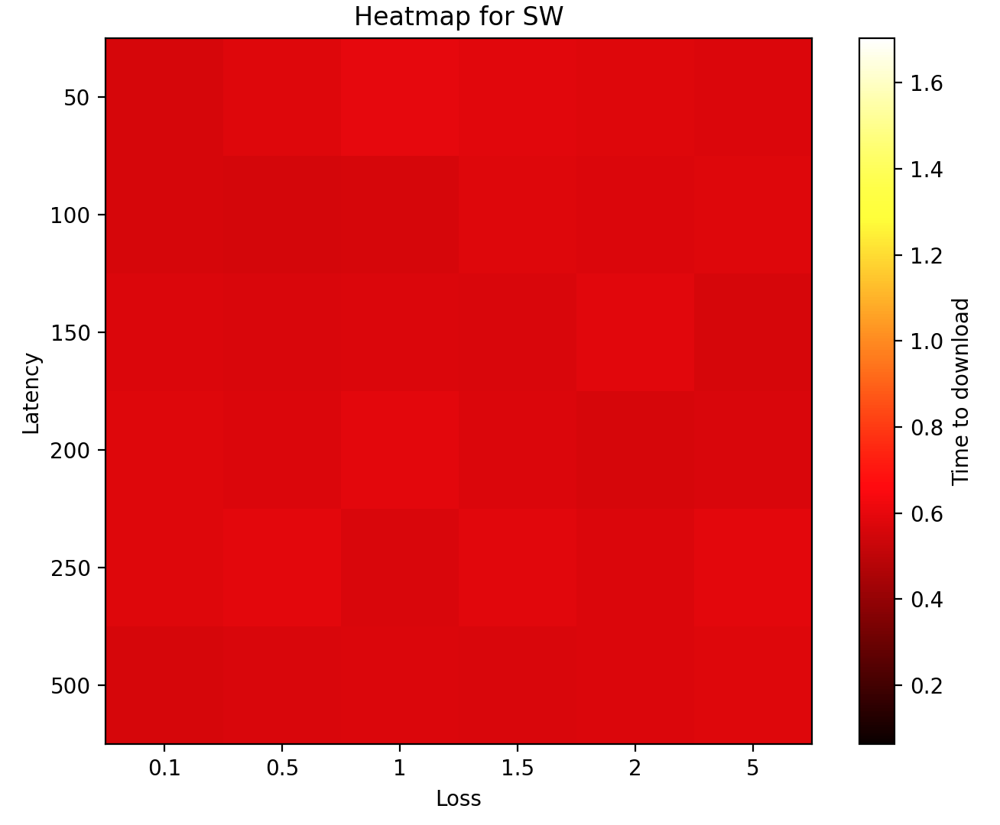
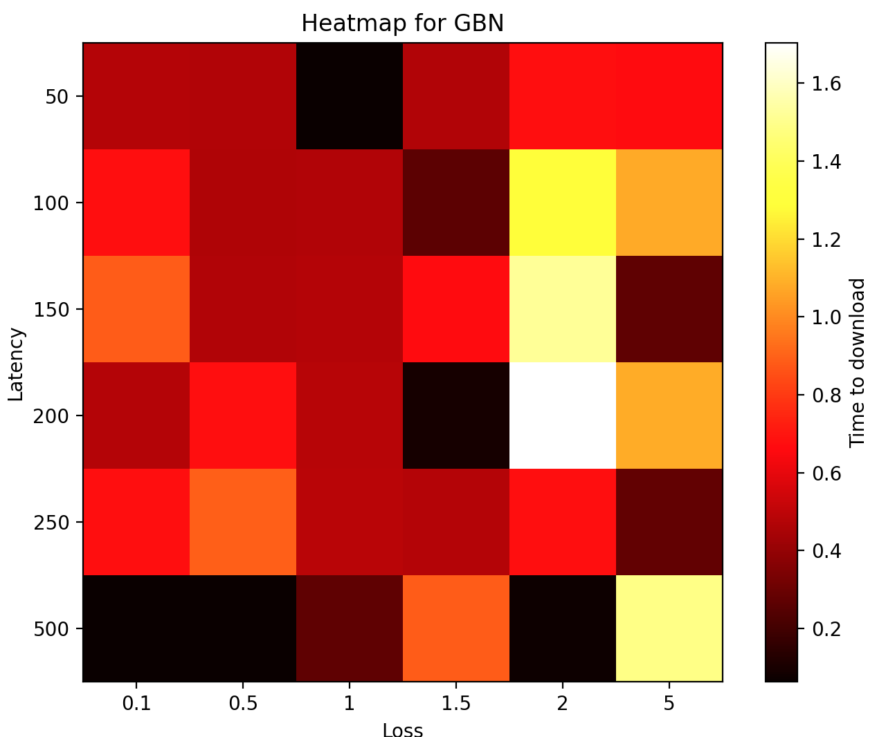
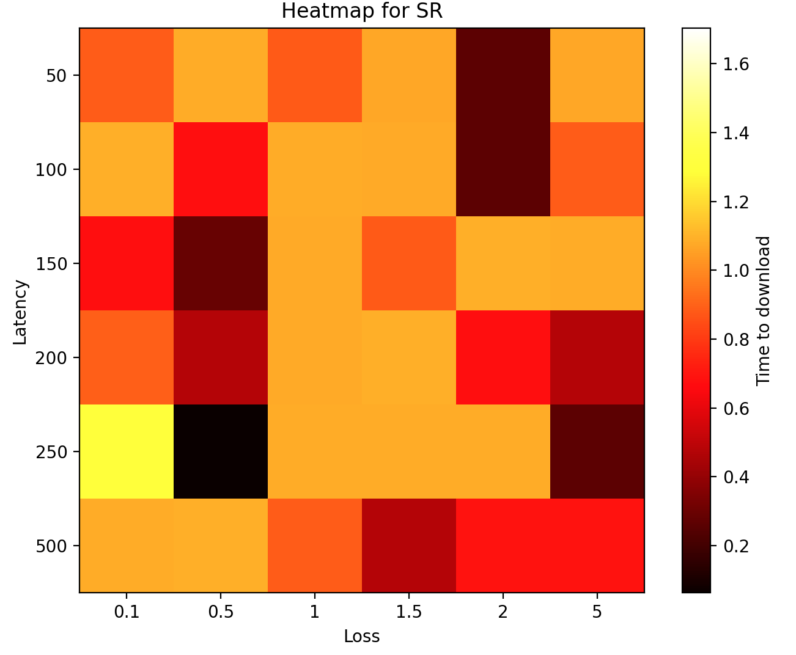

# Assignment 3

### Command to run:

`chmod +x ./main.sh && ./main.sh 0`

### Stop and Wait

    

|     | 0.1        | 0.5        | 1          | 1.5        | 2          | 5          |
| --- | ---------- | ---------- | ---------- | ---------- | ---------- | ---------- |
| 50  | 0.56116605 | 0.57780099 | 0.59848523 | 0.58601785 | 0.58144593 | 0.56993866 |
| 100 | 0.55841064 | 0.55142474 | 0.5625577  | 0.57604313 | 0.57480836 | 0.57864594 |
| 150 | 0.57454252 | 0.56786656 | 0.57518125 | 0.56888413 | 0.58663964 | 0.5575037  |
| 200 | 0.5770185  | 0.57161903 | 0.59484172 | 0.57126904 | 0.55782008 | 0.56803799 |
| 250 | 0.57841635 | 0.59005332 | 0.56623554 | 0.58636856 | 0.57290554 | 0.5938313  |
| 500 | 0.56284118 | 0.56619072 | 0.57270741 | 0.56510854 | 0.57453465 | 0.5803473  |

### Go Back N

    

|     | 0.1        | 0.5        | 1          | 1.5        | 2          | 5          |
| --- | ---------- | ---------- | ---------- | ---------- | ---------- | ---------- |
| 50  | 0.56116605 | 0.57780099 | 0.59848523 | 0.58601785 | 0.58144593 | 0.56993866 |
| 100 | 0.55841064 | 0.55142474 | 0.5625577  | 0.57604313 | 0.57480836 | 0.57864594 |
| 150 | 0.57454252 | 0.56786656 | 0.57518125 | 0.56888413 | 0.58663964 | 0.5575037  |
| 200 | 0.5770185  | 0.57161903 | 0.59484172 | 0.57126904 | 0.55782008 | 0.56803799 |
| 250 | 0.57841635 | 0.59005332 | 0.56623554 | 0.58636856 | 0.57290554 | 0.5938313  |
| 500 | 0.56284118 | 0.56619072 | 0.57270741 | 0.56510854 | 0.57453465 | 0.5803473  |

### Selective Repeat with Cumulative ACK

    

|     | 0.1        | 0.5        | 1          | 1.5        | 2          | 5          |
| --- | ---------- | ---------- | ---------- | ---------- | ---------- | ---------- |
| 50  | 0.88734317 | 1.0826304  | 0.87755942 | 1.07157302 | 0.26532078 | 1.07454252 |
| 100 | 1.08840251 | 0.67575169 | 1.08398652 | 1.0772202  | 0.26298809 | 0.88447094 |
| 150 | 0.67583776 | 0.28829145 | 1.08086014 | 0.87953949 | 1.09135556 | 1.08315611 |
| 200 | 0.89381933 | 0.47734761 | 1.07967281 | 1.09082103 | 0.67524338 | 0.47624683 |
| 250 | 1.28942823 | 0.06307769 | 1.08432579 | 1.08610129 | 1.08595061 | 0.26542282 |
| 500 | 1.08592081 | 1.08852959 | 0.88347077 | 0.47398376 | 0.6859405  | 0.68841434 |

### Commands under the hood

1. `python3 receiver.py [-fileName] [-debugCode] >> {method}.txt`

   1. `fileName`: The file to which the sender's packets are copied
   2. `debugCode`
      1. `0`: No debug outputs
      2. `1`: Debug outputs are logged to stdout
2. `python3 sender.py [-fileName] [-method] [-windowSize] [-debugCode]`

   1. `fileName`: File to read from to create the packets
   2. `method`
      1. `SW`: Stop and Wait
      2. `GBN`: Go Back N
   3. `windowSize`
      1. Need to mention only if `method` == `GBN`
   4. `debugCode`
      1. `0`: No debug outputs
      2. `1`: Debug outputs are logged to stdout
3. `python3 plot.py`
4. `tc qdisc add dev eth0 root handle 1:0 netem rate 800kbit`
5. `tc qdisc change dev eth0 root netem delay ${latency}ms 10ms distribution normal`
6. `tc qdisc change dev eth0 root netem loss ${loss}%`
