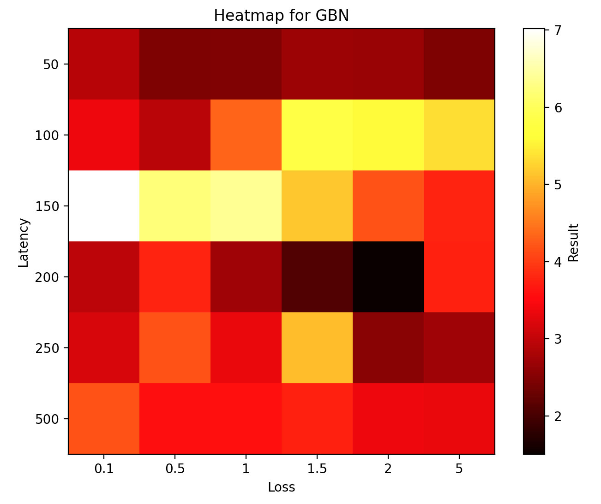
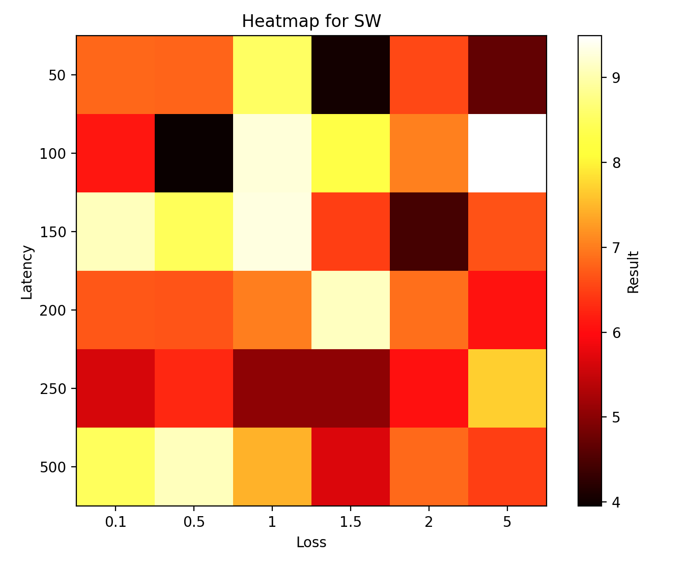

# Assignment 3

### Command to run:

`chmod +x ./main.sh && ./main.sh 0`

### Go Back N

    

|     | 0.1        | 0.5        | 1          | 1.5        | 2          | 5          |
| --- | ---------- | ---------- | ---------- | ---------- | ---------- | ---------- |
| 50  | 2.92644262 | 2.46944642 | 2.49482203 | 2.69797254 | 2.6723783  | 2.45783496 |
| 100 | 3.36761498 | 2.9302218  | 4.33621693 | 5.79117131 | 5.58006644 | 5.35257459 |
| 150 | 7.01728892 | 6.20476866 | 6.38542986 | 5.15930057 | 4.19332147 | 3.77921486 |
| 200 | 2.95493865 | 3.77283192 | 2.7324245  | 2.10833335 | 1.50549603 | 3.76107955 |
| 250 | 3.16389203 | 4.19321585 | 3.33670449 | 5.06122041 | 2.54560709 | 2.7268579  |
| 500 | 4.19531918 | 3.56988049 | 3.57801867 | 3.75845933 | 3.37232518 | 3.34698868 |

### Stop and Wait

    

|       | 0.1         | 0.5         | 1           | 1.5         | 2           | 5           |
|-------|-------------|-------------|-------------|-------------|-------------|-------------|
| 50    | 6.82243633  | 6.8006916   | 8.53096795  | 4.02468252  | 6.55438876  | 4.66925073  |
| 100   | 6.0954864   | 3.95449567  | 9.26957798  | 8.30084682  | 7.04635215  | 9.49024367  |
| 150   | 9.08813     | 8.47337699  | 9.29937887  | 6.4633956   | 4.43925834  | 6.63888621  |
| 200   | 6.6818893   | 6.6720655   | 7.00710516  | 9.10547495  | 6.87452912  | 6.06197596  |
| 250   | 5.63201761  | 6.2693603   | 5.04058981  | 5.04611683  | 6.04699969  | 7.68725467  |
| 500   | 8.47850442  | 9.08625436  | 7.45506907  | 5.67628717  | 6.84892607  | 6.47744966  |

### Commands under the hood

1. `python3 receiver.py [-fileName] [-debugCode] >> {method}.txt`

   1. `fileName`: The file to which the sender's packets are copied
   2. `debugCode`
      1. `0`: No debug outputs
      2. `1`: Debug outputs are logged to stdout
2. `python3 sender.py [-fileName] [-method] [-windowSize] [-debugCode]`

   1. `fileName`: File to read from to create the packets
   2. `method`
      1. `SW`: Stop and Wait
      2. `GBN`: Go Back N
   3. `windowSize`
      1. Need to mention only if `method` == `GBN`
   4. `debugCode`
      1. `0`: No debug outputs
      2. `1`: Debug outputs are logged to stdout
3. `python3 plot.py`
4. `tc qdisc add dev eth0 root handle 1:0 netem rate 800kbit`
5. `tc qdisc change dev eth0 root netem delay ${latency}ms 10ms distribution normal`
6. `tc qdisc change dev eth0 root netem loss ${loss}%`

**Disclaimer:** There was a resource issue while running the batch script, so it was run in batches to get the values of the download time.
