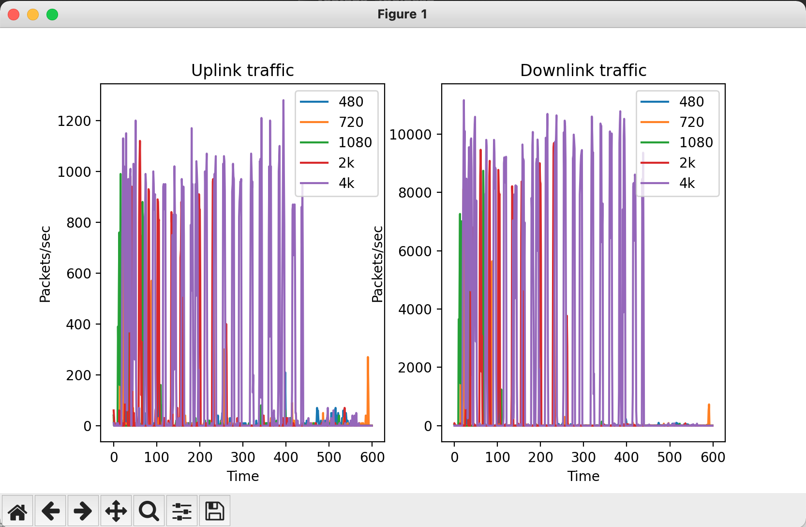

## Activity 1

### Part A

#### Setup

1. Create a `.env` file with the local IP address of your PC when you took the `pcap` trace
2. The variable should be called `LOCAL_IP_ADDRESS`
3. Example: `LOCAL_IP_ADDRESS="10.42.169.54"`
4. This is required for figuring out if the packet is `uplink/downlink`

**Question1 :** The graphs that were obtained for the `uplink` and `downlink` traffic are shown below

**Question 2:** The burst fraction for different resolutions are mentioned below:

1. 480p: 0.02
2. 720p: 0.10
3. 1080p: 0.15
4. 2k: 0.43
5. 4k: 0.61
