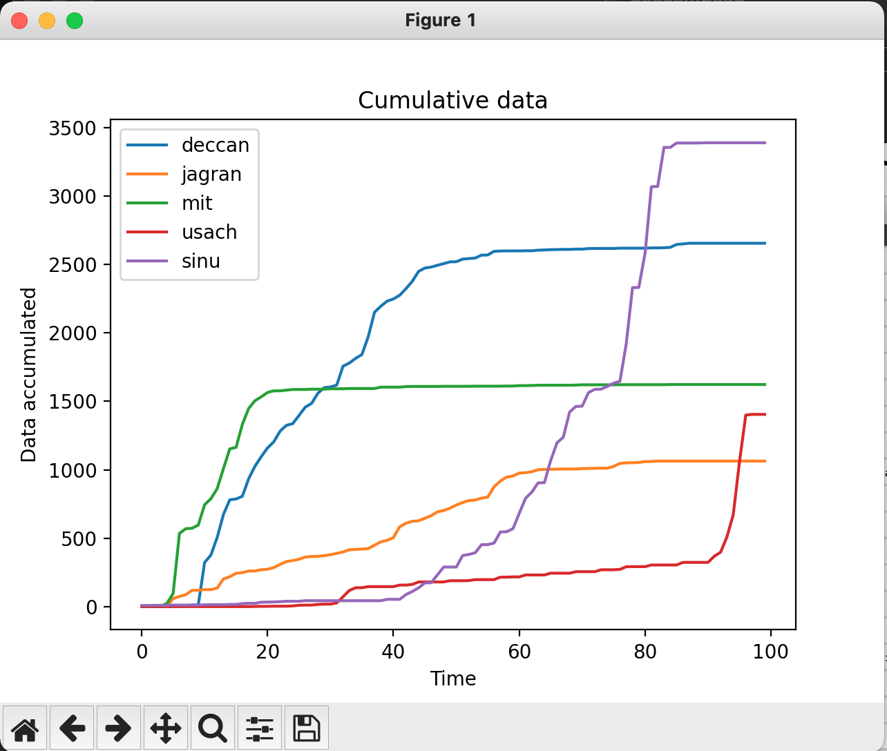

## Activity 1

### Part A

#### Setup

1. Create a `.env` file with the local IP address of your PC when you took the `pcap` trace
2. The variable should be called `LOCAL_IP_ADDRESS_A`
3. Example: `LOCAL_IP_ADDRESS="10.42.169.54"`
4. This is required for figuring out if the packet is `uplink/downlink`

**Question1 :** The graphs that were obtained for the `uplink` and `downlink` traffic are shown below

**Question 2:** The burst fraction for different resolutions are mentioned below:

1. 480p: 0.02
2. 720p: 0.10
3. 1080p: 0.15
4. 2k: 0.43
5. 4k: 0.61

### Part B

#### Setup

1. In the same `.env` file, create a variable called `LOCAL_IP_ADDRESS_B`
2. This is to take care of dynamic IPs
3. For example, `LOCAL_IP_ADDRESS_B="10.42.170.206"`

**Question 1:** The time taken to complete each DNS query is listed below

- Deccan - 1.2ms
- Jagran - 1.1ms
- MIT - 13.9ms
- Usach - 54.3ms
- Sinu - 11.3ms

**Insights:** The time taken to resolve the DNS completely is dependent on the distance between our PC and the destination server. Since `MIT` and `Usach` probably have their `VPS` in _USA_ and _Chile_ respectively, it took `1 order` of magnitude higher (in time). This is one factor in the entire process. Since these websites were visited for the first time, their `DNS` lookup was not cached. In that case it would have taken lesser time than the other websites.

**Question 2:** TBD

**Question 3:** The cumulative plots are shown below

